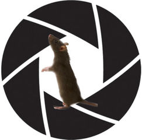

# Mouse Recorder

###A cheap, modular, behavior recording program

# Purpose

The program's is designed to record rodent behavior at specific intervals of time, based on the initiation of a trigger event (e.g., the press of a lever.

# Building

To install, use standard python installation procedure:

    python setup.py install

Additionally, the program requires installation of [`setuptools`](https://pypi.python.org/pypi/setuptools)

# Development

### Installing

Enter the following into the terminal to install the program:

    git clone https://github.com/bnhwa/mouse_record
    python setup.py develop

### Updating

To update the program, first specify the directory to where the mouse_record file is saved to. Then, enter the `git pull` command. An example is provided as follows:

    git pull

This will ensure that the software is up-to-date.

### Uninstalling

Enter the following into the terminal to install the program:

    python setup.py develop --uninstall

# Testing

Not implemented yet.

# Usage

Once the desired arguments are provided by the user (e.g., seconds to record before and after a trigger event and directory) the program will initiate. For, each time a trigger event is initiated, the program will write the specified recording intervals into a h264 video file. The program will continue to run until a `KeyboardInterrupt` is entered into the terminal

##Picture Usage

Execution of the program consists of the program name and a single argument, the directory in which the picture is to be saved into.

    mouse-picture ~/Destkop

##Preview Usage

Execution of the program consists of the program name and a single argument: the time desired length of the camera preview (in seconds). Additionally, the user can exit at any time by entering `Ctrl + c`

    mouse-preview 60

##Recorder Usage

Execution of the program consists of the program name and respectve arguments: time to record before trigger event (in seconds), time to record after (in seconds), and directory of the file to be saved into. An example is shown below:

    mouse-record 2 2 /home/pi/Desktop

Also, as mentioned before, the program will end when a `KeyboardInterrupt`(Ctrl + c) is entered into the terminal.

